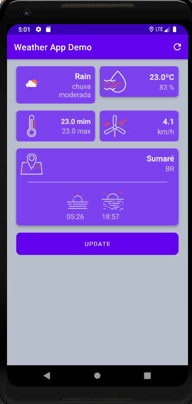
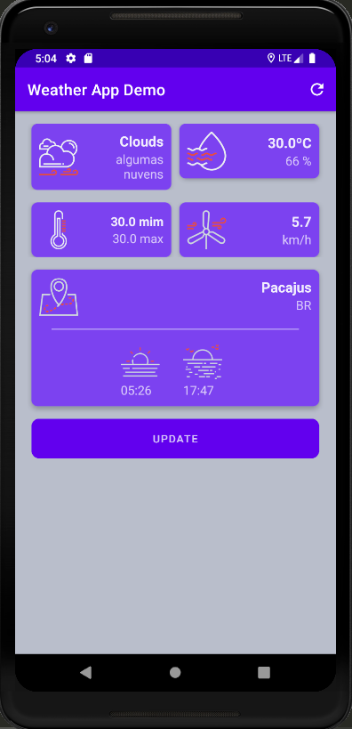

# Weather App Demo 

###  App Demo para consumir os dados da API de tempo

Desenvolvido para praticar o desenvolvimento Android Nativo com Kotlin.

 A partir da localização do usuário pelo GPS ou A-GPS o app reconhece o local,
  e faz a requisição para a API, retornando os valores para os respectivos cards.
   Podemos atualizar as informações a qualquer momento presionando o botão update ou o botão update no menu.

**obs:** Na Temperatura máxima e mínima a app não fornece essa informações para todas as regiões.
#### Foi utilizado nesse projeto:
> - [View Binding](https://developer.android.com/topic/libraries/view-binding)
> - [API Openweathermap](https://openweathermap.org)
> - [Retrofit2](https://square.github.io/retrofit/)
> - [Gson](https://square.github.io/retrofit/)
> - [Dexter](https://github.com/Karumi/Dexter)
#### Imagens do app:

